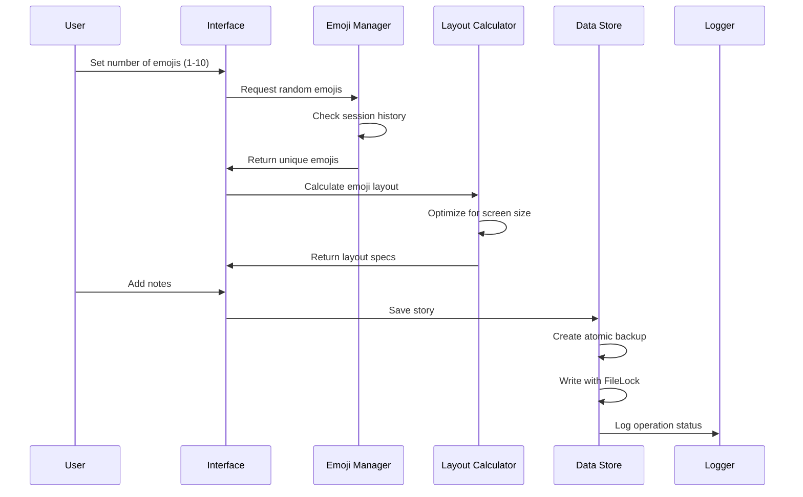
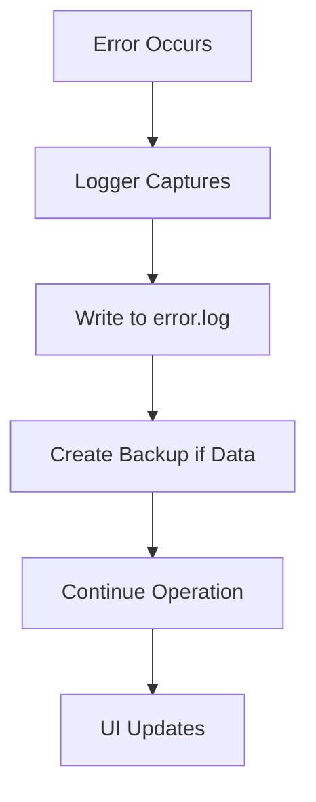
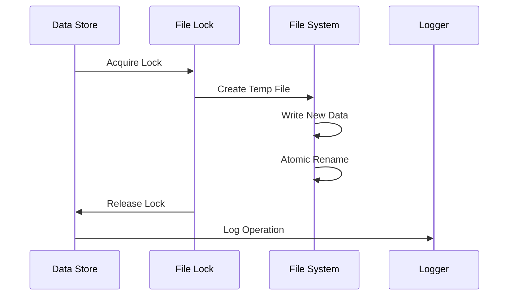

# Emoji Story Builder

## repo
https://github.com/pleabargain/emoji-story-builder

## Project Overview
A Streamlit-based application that helps users create stories using random emojis. The application dynamically sizes emojis to fit the screen, allows for note-taking, and maintains a history of interactions in JSON format with atomic file operations and comprehensive error logging.

> [!IMPORTANT]
> **Local Ollama Requirement:** This application runs only locally and requires Ollama to be running in the background. The AI story generation feature connects to a local Ollama instance at `http://localhost:11434`. Make sure Ollama is installed and running before starting the application.

## System Architecture
graph TD
    A[User Interface] --> B[Emoji Manager]
    A --> C[Data Store]
    A --> I[Ollama Client]
    A --> J[Debug Console]
    B --> D[Random Emoji Generator]
    B --> E[Layout Calculator]
    C --> F[Atomic JSON Storage]
    I --> K[Local Llama 3.2]
    G[Logger] --> H[Error Log]
    A --> G
    B --> G
    C --> G
    D --> G
    E --> G
    F --> G
    I --> G

## Key Workflows

### Story Creation Flow


### Error Handling Flow


### Session Management Flow


## Setup Instructions

> [!NOTE]
> **Prerequisite:** This application requires Ollama to be installed and running locally. The app connects to Ollama at `http://localhost:11434` for AI story generation features.

1. Requirements:
   - Python 3.8+
   - Ollama installed and running locally (see [Ollama installation guide](https://ollama.ai))
   - Required Python packages:
     ```
     streamlit
     filelock
     python-dateutil
     ```

2. Installation:
   ```bash
   pip install -r requirements.txt
   # OR using uv
   uv pip install -r requirements.txt
   ```

3. Running the Application:
   ```bash
   streamlit run src/app.py
   # OR using uv
   uv run streamlit run src/app.py
   ```

## Project Structure
```
emoji-story-builder/
├── cline_docs/          # Project documentation
├── src/
│   ├── __init__.py     # Python package marker
│   ├── app.py          # Main Streamlit application
│   ├── emoji_manager.py # Emoji selection and layout
│   ├── data_store.py   # Atomic JSON operations
│   ├── logger.py       # Centralized logging
│   ├── test_logger.py  # Logger unit tests
│   └── streamlitemojis.txt # Emoji definitions
├── data/
│   └── sessions.json   # Session storage with locks
├── logs/
│   └── error.log      # Centralized error logging
└── src/tests/         # Unit test suite
    ├── test_app_logic.py
    └── test_ollama_client.py
```

## Technical Details

### Data Storage
- Atomic file operations using FileLock
- ISO 8601 timestamp format (YYYY-MM-DDTHH:mm:ss.sssZ)
- Automatic backup creation for corrupted files
- Thread-safe JSON operations

### Emoji Management
- Dynamic size calculation based on screen dimensions
- Optimal grid layout (max 3 emojis per row)
- Session-based uniqueness tracking
- Automatic reset when unique emojis exhausted

### Error Handling
- Centralized logging system
- Automatic log rotation
- Comprehensive error context
- Graceful degradation

### Layout System
- Responsive grid layout
- Dynamic size calculations
- Screen dimension optimization
- Minimum size guarantees (50px)

## New Feature: AI Story Generation from Emojis (2024-06-09)

You can now generate a creative story based on the currently displayed emojis using the Ollama Llama 3.2 model. This feature includes:

- **Word Count Slider:** Choose the approximate length of the story (50–500 words).
- **Temperature Slider:** Control the creativity of the generated story (0.1–1.5, default 1.2).
- **Generate Story Button:** Sends the emojis, word count, and temperature to the Llama 3.2 model running locally via Ollama, and displays the generated story in the UI.
- **Prompt Engineering:** The model is instructed to write a story with a beginning, middle, and end, inspired by the emojis.

### How it Works
1. Generate emojis as usual.
2. Adjust the word count and temperature sliders below the emojis.
3. Click "Generate Story from Emojis" to create a story.
4. The story will appear in a text area below the controls.

### New Feature: Dynamic Model Selection & Quality Assurance (2025-12-20)
The application now automatically detects available local Ollama models and allows you to choose which one to use for story generation.

- **Model Selector:** Choose from your installed Ollama models via a dropdown menu.
- **Structural Integrity Tests:** Verifies that the app's entry points (like `def main()`) are present and callable.
- **Model Existence Check:** Unit tests and internal scripts now verify that selected models exist before generation is attempted, preventing "404 Not Found" errors.
- **Optimized Browser Console Signaling:** Verbose logging of Ollama I/O is now sent to the browser developer console (F12) using a unified collector pattern to minimize console noise.
- **JS Integration Tests:** Unit tests verify that server-side events correctly trigger the unified browser-side logging components.
- **Service Mocking:** Tests the `OllamaClient` using mocks to ensure logic is correct without needing a live LLM.

To run the tests:
```bash
uv run python -m unittest discover src/tests
```

> [!IMPORTANT]
> **Integration Testing Note:** The file `src/tests/test_ollama_integration.py` contains a live integration test that targets a hardcoded model (`gemma3:4b`). If you do not have this model installed, the test will skip. You can manually edit this file to target a different locally installed model.

_Last updated: 2026-01-13_

## Known Issues & Roadmap
- [TODO] [Low Priority] Fix Mermaid diagram rendering in the Documentation tab. Currently, diagrams may fail to render or show syntax errors despite valid code.

## Antigravity Thoughts About This Project

### Critique
- **Hardcoded Values**: The application relies on several hardcoded values, such as screen dimensions in `app.py` (800x600 default) and the Ollama API URL (`http://localhost:11434`). This reduces flexibility and portability.
- **Tight Coupling**: `emoji_manager.py` contains layout logic that mixes data processing with presentation concerns. It would be cleaner to separate the "calculation" of positions from the "management" of emoji data.
- **UI Logic in Main**: `app.py` is becoming a "God file," handling everything from UI rendering to API calls and state management. Breaking this down into smaller, focused modules (e.g., `ui_components.py`, `api_client.py`) would improve maintainability.

### Advice
- **External Configuration**: Move hardcoded values (API URLs, default sizes, timeouts) into a `config.py` file or environment variables. This makes deployment and adjustment much easier.
- **Responsiveness**: Instead of calculating pixel-perfect layouts in Python, lean more on Streamlit's native layout capabilities or custom CSS. This allows the browser to handle responsiveness more naturally.
- **Refactor AI Logic**: Encapsulate the LLM interaction into a dedicated class. This isolates the dependency on `requests` and `Ollama`, making it easier to swap providers or mock for testing in the future.

- **Local AI Integration**: Seamlessly integrating a local LLM (Ollama) demonstrates a modern, privacy-focused approach to AI features.

## Development Retrospective & Lessons Learned

### Challenges Encountered
1.  **Mermaid Diagram Rendering**:
    *   **Problem**: Streamlit's default markdown renderer does not support Mermaid diagrams. Attempts to use custom HTML components (iframe) failed due to browser sandbox restrictions and newline handling issues.
    *   **Resolution Attempt**: We tried implementing a custom renderer in `app.py` using `st.components.v1.html` with the Mermaid.js library, avoiding HTML escaping and using `<pre>` tags. However, this did not consistently resolve the rendering issues in the Streamlit environment.
    *   **Status**: **Unresolved**. Gemini 3 Pro could not find a stable fix for this problem within the constraints of the current Streamlit architecture. Diagrams may still fail to render or show syntax errors.

2.  **UI State & Race Conditions**:
    *   **Problem**: Generated stories were logging to the console but not appearing in the UI. This was because the Streamlit script needed a "nudge" to re-render after the long-running API call completed.
    *   **Resolution**: We added `st.rerun()` immediately after the generation completed.
    *   **Testing**: We added a specific unit test `test_ui_logic.py` to verify that the state variable `generated_story` was correctly populated by the generation function, strictly finding the bug to the presentation layer.

3.  **Terminal Timeouts**:
    *   **Problem**: Larger models like `gemma3:4b` took longer than 60s to load/respond, causing `ReadTimeout` errors in the terminal.
    *   **Resolution**: Increased the `timeout` in `OllamaClient` to 300 seconds.

### The Role of Unit Testing
This project demonstrated that even for a frontend-heavy Streamlit app, unit tests are vital.
*   **Isolation**: We used tests like `test_ui_logic.py` to prove that the *data* was correct (the story existed in state), which meant the bug *had* to be in the *rendering* (the `st.text_area` call).
*   **Integration**: The `test_ollama_integration.py` gave us confidence that the backend was working without needing to run the full UI, saving huge amounts of time during debugging.

## Recommendations for Building with Antigravity

when using Antigravity (or any AI agent) to build Streamlit apps, follow these best practices:

1.  **"Test First" Mentality**: explicitely ask the agent to "Create a unit test for this feature" *before* writing the feature code. This forces the agent to understand the logic and input/output structure clearly.
2.  **Verbose Browser Logging**: Ask the agent to implement a `browser_log` function early on. Streamlit hides a lot of server-side activity; having logs appear in your browser's F12 console (via `st.components.v1.html`) makes debugging interaction issues 10x faster.
3.  **Live Integration Tests**: For AI apps, don't just mock everything. Create one "Integration Test" file that hits your real local LLM (like `src/tests/test_ollama_integration.py`). Mark it clearly so you know it requires the real model.

## Why Use Python UV?
This project uses `uv` for dependency management.

**Pros:**
*   **Speed**: It is orders of magnitude faster than `pip` for resolving and installing packages.
*   **Unified Tool**: It replaces `pip`, `venv`, `poetry`, and `pyenv`. One command `uv run script.py` handles the environment creation, package installation, and execution in one go.
*   **Determinism**: The `uv.lock` file ensures that everyone working on the project has the exact same package versions.

**Cons:**
*   **Learning Curve**: It requires learning new commands (e.g., `uv add` instead of `pip install`, `uv run` instead of `python`).
*   **Adoption**: It is newer than `pip`, so some obscure edge-Cases with complex C-extensions might still be maturing (though it is generally very robust).
