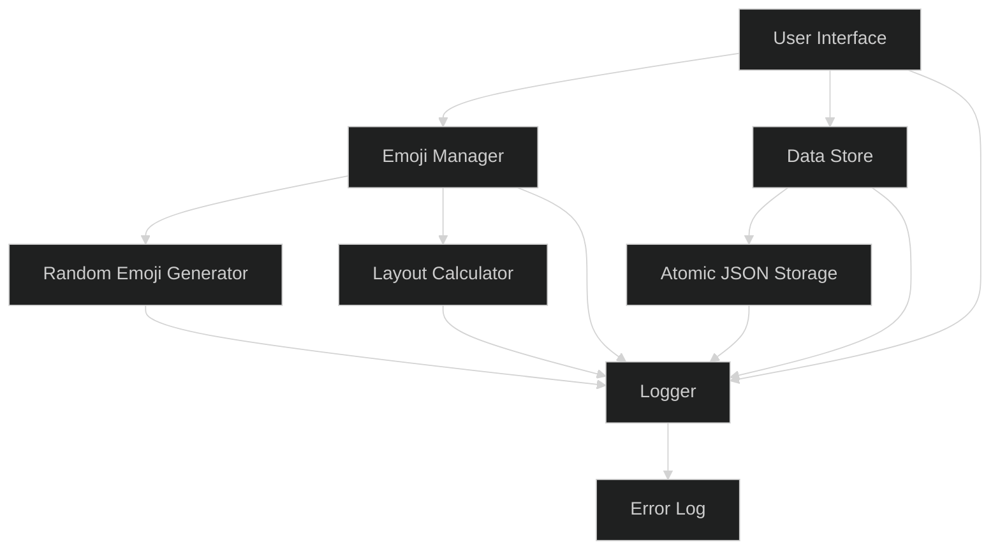
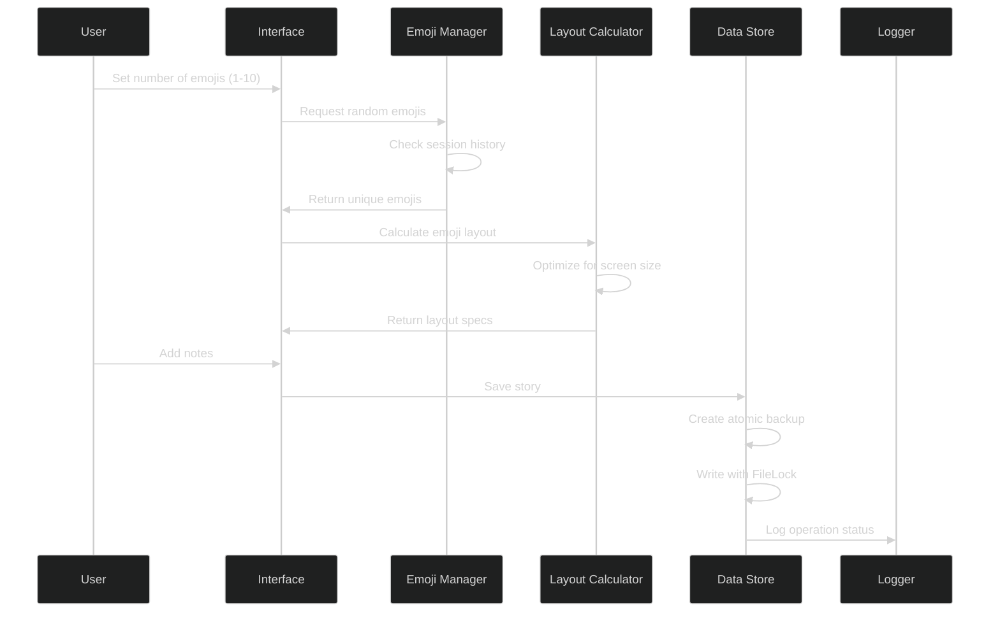
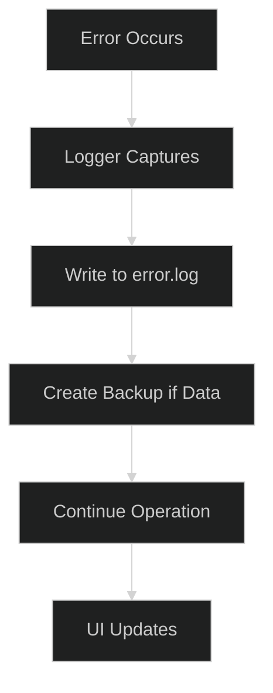
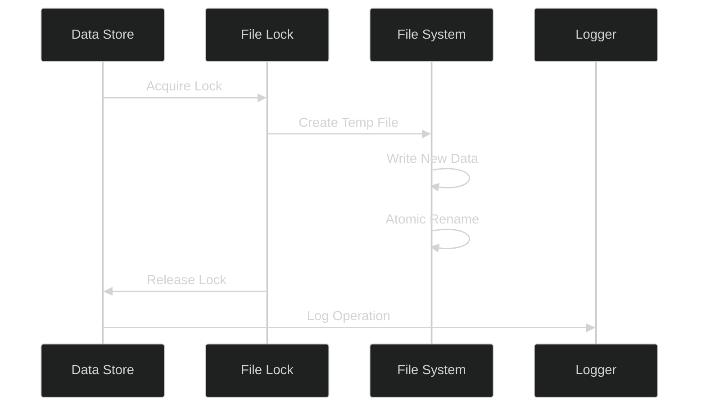

# Emoji Story Builder

## repo
https://github.com/pleabargain/emoji-story-builder

## Project Overview
A Streamlit-based application that helps users create stories using random emojis. The application dynamically sizes emojis to fit the screen, allows for note-taking, and maintains a history of interactions in JSON format with atomic file operations and comprehensive error logging.

## System Architecture


## Key Workflows

### Story Creation Flow


### Error Handling Flow


### Session Management Flow


## Setup Instructions

1. Requirements:
   - Python 3.8+
   - Required Python packages:
     ```
     streamlit
     filelock
     python-dateutil
     ```

2. Installation:
   ```bash
   pip install -r requirements.txt
   ```

3. Running the Application:
   ```bash
   streamlit run src/app.py
   ```

## Project Structure
```
emoji-story-builder/
├── cline_docs/          # Project documentation
├── src/
│   ├── __init__.py     # Python package marker
│   ├── app.py          # Main Streamlit application
│   ├── emoji_manager.py # Emoji selection and layout
│   ├── data_store.py   # Atomic JSON operations
│   ├── logger.py       # Centralized logging
│   ├── test_logger.py  # Logger unit tests
│   └── streamlitemojis.txt # Emoji definitions
├── data/
│   └── sessions.json   # Session storage with locks
└── logs/
    └── error.log      # Centralized error logging
```

## Technical Details

### Data Storage
- Atomic file operations using FileLock
- ISO 8601 timestamp format (YYYY-MM-DDTHH:mm:ss.sssZ)
- Automatic backup creation for corrupted files
- Thread-safe JSON operations

### Emoji Management
- Dynamic size calculation based on screen dimensions
- Optimal grid layout (max 3 emojis per row)
- Session-based uniqueness tracking
- Automatic reset when unique emojis exhausted

### Error Handling
- Centralized logging system
- Automatic log rotation
- Comprehensive error context
- Graceful degradation

### Layout System
- Responsive grid layout
- Dynamic size calculations
- Screen dimension optimization
- Minimum size guarantees (50px)

## New Feature: AI Story Generation from Emojis (2024-06-09)

You can now generate a creative story based on the currently displayed emojis using the Ollama Llama 3.2 model. This feature includes:

- **Word Count Slider:** Choose the approximate length of the story (50–500 words).
- **Temperature Slider:** Control the creativity of the generated story (0.1–1.5, default 1.2).
- **Generate Story Button:** Sends the emojis, word count, and temperature to the Llama 3.2 model running locally via Ollama, and displays the generated story in the UI.
- **Prompt Engineering:** The model is instructed to write a story with a beginning, middle, and end, inspired by the emojis.

### How it Works
1. Generate emojis as usual.
2. Adjust the word count and temperature sliders below the emojis.
3. Click "Generate Story from Emojis" to create a story.
4. The story will appear in a text area below the controls.

**Note:** Ollama must be running locally with the Llama 3.2 model loaded for this feature to work.

---

_Last updated: 2024-06-09_
